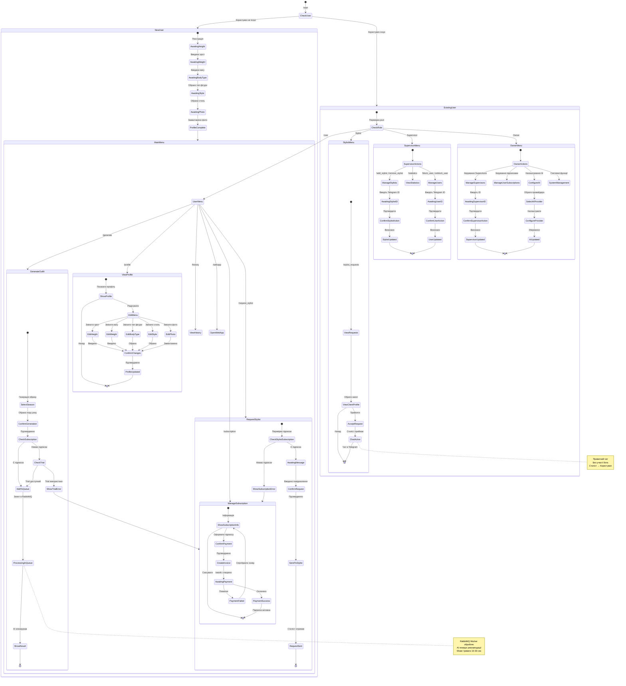

# 🎨 Fashion Telegram Bot - Індивідуальний підбір одягу

[](https://www.python.org/downloads/)
[](https://docs.aiogram.dev/)
[](https://www.mongodb.com/)
[](https://www.rabbitmq.com/)

Telegram бот для індивідуального підбору одягу за допомогою AI. Користувачі можуть отримати персоналізовані рекомендації на основі їх параметрів тіла, стилю та пори року.

## 📋 Зміст

- [Основні можливості](#-основні-можливості)
- [Технології](#-технології)
- [Архітектура](#-архітектура)
- [Швидкий старт](#-швидкий-старт)
- [Конфігурація](#-конфігурація)
- [Розгортання](#-розгортання)
- [API документація](#-api-документація)
- [Тестування](#-тестування)
- [Внесок](#-внесок)

---

## 🎯 Основні можливості

### Для користувачів:
- ✅ Реєстрація з детальним профілем (зріст, вага, тип фігури, стиль)
- ✅ 1 безкоштовний тестовий запит на генерацію
- ✅ AI-генерація образів одягу для різних пір року
- ✅ Щомісячна підписка ($10/місяць)
- ✅ Необмежена кількість генерацій з підпискою
- ✅ Історія останніх 5 генерацій
- ✅ Запит консультації стиліста
- ✅ Web App з каталогом одягу
- ✅ Редагування профілю

### Для стилістів:
- ✅ Отримання запитів від користувачів
- ✅ Перегляд анкет клієнтів
- ✅ Приватні консультації в Telegram

### Для адміністрації:
- ✅ **Supervisor**: керування стилістами, статистика, блокування користувачів
- ✅ **Owner**: повний контроль, керування підписками, налаштування AI
- ✅ Детальна статистика та аналітика
- ✅ Логування всіх дій

---

## 🛠️ Технології

### Backend:
- **Python 3.12.3** - основна мова програмування
- **aiogram 3.4** - Telegram Bot framework
- **MongoDB 7.0** - NoSQL база даних
- **Motor** - async MongoDB driver
- **RabbitMQ 3.12** - черга повідомлень
- **aio-pika** - async RabbitMQ client

### AI Integration:
- **Google Gemini API** - основний AI провайдер (безкоштовний)
- **OpenAI API** - опціонально
- **Anthropic Claude API** - опціонально

### Payment:
- **LiqPay API** - обробка платежів (test mode)

### DevOps:
- **Docker & Docker Compose** - контейнеризація
- **structlog** - structured logging
- **pytest** - тестування

---

## 🏗️ Архітектура

### Діаграма компонентів:

```
┌─────────────────┐
│  Telegram Bot   │
│   (aiogram 3)   │
└────────┬────────┘
         │
         ├──────────────┐
         │              │
    ┌────▼─────┐   ┌───▼──────┐
    │ MongoDB  │   │ RabbitMQ │
    │          │   │          │
    └──────────┘   └────┬─────┘
                        │
                   ┌────▼─────┐
                   │ AI Worker│
                   │  (Gemini)│
                   └──────────┘
```

### State Machine:
Детальна діаграма станів доступна в [State Machine Diagram](#state-machine-diagram)



### База даних:
ER-діаграма MongoDB доступна в документації проєкту

---

## 🚀 Швидкий старт

### Передумови:
- Docker 24.0+
- Docker Compose 2.20+
- 2GB RAM (мінімум)
- 10GB вільного місця

### 1. Клонування репозиторію:

```bash
git clone https://github.com/d-melleo/Fashion-Bot.git
cd fashion-telegram-bot
```

### 2. Налаштування середовища:

```bash
# Створити .env файл
cp .env.example .env

# Відредагувати .env файл
nano .env
```

**Обов'язкові параметри для редагування:**

```env
BOT_TOKEN=your_telegram_bot_token_from_@BotFather
OWNER_TELEGRAM_ID=your_telegram_id_from_@userinfobot

MONGO_ROOT_PASSWORD=create_strong_password_here
RABBITMQ_PASSWORD=create_strong_password_here

GEMINI_API_KEY=your_gemini_api_key_from_google

LIQPAY_PUBLIC_KEY=your_liqpay_public_key
LIQPAY_PRIVATE_KEY=your_liqpay_private_key

SECRET_KEY=generate_random_secret_key
```

### 3. Запуск:

```bash
# Запуск всіх сервісів
docker-compose up -d

# Перевірка логів
docker-compose logs -f bot

# Перевірка статусу
docker-compose ps
```

### 4. Зупинка:

```bash
# Зупинка всіх сервісів
docker-compose down

# Зупинка з видаленням volumes (УВАГА: видаляє всі дані!)
docker-compose down -v
```

---

## ⚙️ Конфігурація

### Отримання API ключів:

#### 1. Telegram Bot Token:
1. Відкрити [@BotFather](https://t.me/BotFather) в Telegram
2. Відправити `/newbot`
3. Слідувати інструкціям
4. Скопіювати отриманий token

#### 2. Gemini API Key:
1. Перейти на [Google AI Studio](https://makersuite.google.com/)
2. Натиснути "Get API key"
3. Створити новий проєкт або обрати існуючий
4. Скопіювати API key

#### 3. LiqPay Keys:
1. Зареєструватися на [LiqPay](https://www.liqpay.ua/)
2. Перейти в розділ "API"
3. Отримати Public Key та Private Key
4. Увімкнути Test Mode

### Owner Telegram ID:
1. Відкрити [@userinfobot](https://t.me/userinfobot) в Telegram
2. Натиснути `/start`
3. Скопіювати ваш ID

---

## 📦 Розгортання

### Development:

```bash
# Запуск з профілем dev (включає Mongo Express)
docker-compose --profile dev up -d

# Mongo Express буде доступний на http://localhost:8081
# Логін/Пароль з .env файлу
```

### Production:

```bash
# Встановити ENVIRONMENT=production в .env
ENVIRONMENT=production

# Запустити без dev профілю
docker-compose up -d

# Налаштувати зовнішній nginx для SSL
# Приклад конфігурації в docs/nginx.conf
```

### Масштабування AI Workers:

```yaml
# В docker-compose.yml змінити replicas
ai_worker:
  deploy:
    replicas: 2  # Збільшити для більшої швидкості обробки
```

---

## 📚 API Документація

### Команди бота:

#### Користувач:
| Команда | Опис |
|---------|------|
| `/start` | Початок роботи/реєстрація |
| `/menu` | Головне меню |
| `/profile` | Переглянути/редагувати профіль |
| `/generate` | Згенерувати образ одягу |
| `/history` | Переглянути останні 5 генерацій |
| `/subscription` | Статус підписки |
| `/subscribe` | Оформити підписку |
| `/request_stylist` | Запит на стиліста |
| `/webapp` | Відкрити Web App |
| `/help` | Довідка |
| `/cancel` | Скасувати поточну операцію |

#### Стиліст:
| Команда | Опис |
|---------|------|
| `/stylist_requests` | Переглянути запити |
| `/my_chats` | Активні чати |

#### Supervisor:
| Команда | Опис |
|---------|------|
| `/add_stylist` | Додати стиліста |
| `/remove_stylist` | Видалити стиліста |
| `/list_stylists` | Список стилістів |
| `/statistics` | Статистика бота |
| `/block_user` | Заблокувати користувача |
| `/unblock_user` | Розблокувати користувача |

#### Owner:
| Команда | Опис |
|---------|------|
| `/add_supervisor` | Додати супервайзера |
| `/remove_supervisor` | Видалити супервайзера |
| `/list_admins` | Список адмінів |
| `/manage_subscription` | Керування підпискою |
| `/ai_settings` | Налаштування AI |
| `/db_backup` | Бекап БД |
| `/system_status` | Статус системи |

---

## 🧪 Тестування

### Запуск тестів:

```bash
# Встановити залежності для тестування
pip install -r requirements.txt

# Запуск всіх тестів
pytest

# Запуск з coverage
pytest --cov=app --cov-report=html

# Запуск конкретного тесту
pytest tests/test_handlers/test_generation.py
```

### Структура тестів:

```
tests/
├── test_handlers/
│   ├── test_user_handlers.py
│   ├── test_generation.py
│   └── test_payment.py
├── test_services/
│   ├── test_ai_service.py
│   ├── test_liqpay.py
│   └── test_rabbitmq.py
└── test_utils/
    └── test_validators.py
```

---

## 📊 Моніторинг

### Логи:

```bash
# Bot логи
docker-compose logs -f bot

# AI Worker логи
docker-compose logs -f ai_worker

# RabbitMQ логи
docker-compose logs -f rabbitmq

# MongoDB логи
docker-compose logs -f mongodb

# Всі логи разом
docker-compose logs -f
```

### Логи зберігаються в:
- `logs/bot.log` - логи бота
- `logs/ai_worker.log` - логи AI worker

### RabbitMQ Management UI:
- URL: `http://localhost:15672`
- Логін/Пароль з `.env` файлу

### Mongo Express (dev only):
- URL: `http://localhost:8081`
- Логін/Пароль з `.env` файлу

---

## 🔒 Безпека

### Best Practices:
- ✅ Ніколи не коммітьте `.env` файл
- ✅ Використовуйте strong passwords
- ✅ Увімкніть 2FA для production
- ✅ Регулярно оновлюйте залежності
- ✅ Моніторьте логи на підозрілу активність

### Backup:

```bash
# Створення backup MongoDB
docker-compose exec mongodb mongodump --out /backup

# Копіювання backup на хост
docker cp fashion_bot_mongodb:/backup ./backups/$(date +%Y%m%d)
```

---

## 🤝 Внесок

Ми раді будь-якому внеску! Будь ласка, дотримуйтесь наступних кроків:

1. Fork проєкту
2. Створіть feature branch (`git checkout -b feature/AmazingFeature`)
3. Commit зміни (`git commit -m 'Add some AmazingFeature'`)
4. Push в branch (`git push origin feature/AmazingFeature`)
5. Відкрийте Pull Request

---

## 📝 Ліцензія

Distributed under the MIT License. See `LICENSE` for more information.

---

## 📧 Контакти

Project Link: [https://github.com/d-melleo/Fashion-Bot.git](https://github.com/d-melleo/Fashion-Bot.git)

---

## 🙏 Подяки

- [aiogram](https://docs.aiogram.dev/) - за чудовий Telegram Bot framework
- [Google Gemini](https://deepmind.google/technologies/gemini/) - за безкоштовний AI API
- [LiqPay](https://www.liqpay.ua/) - за платіжний API
- [Fake Store API](https://fakestoreapi.com/) - за тестовий каталог

---

**Made with ❤️ in Ukraine**